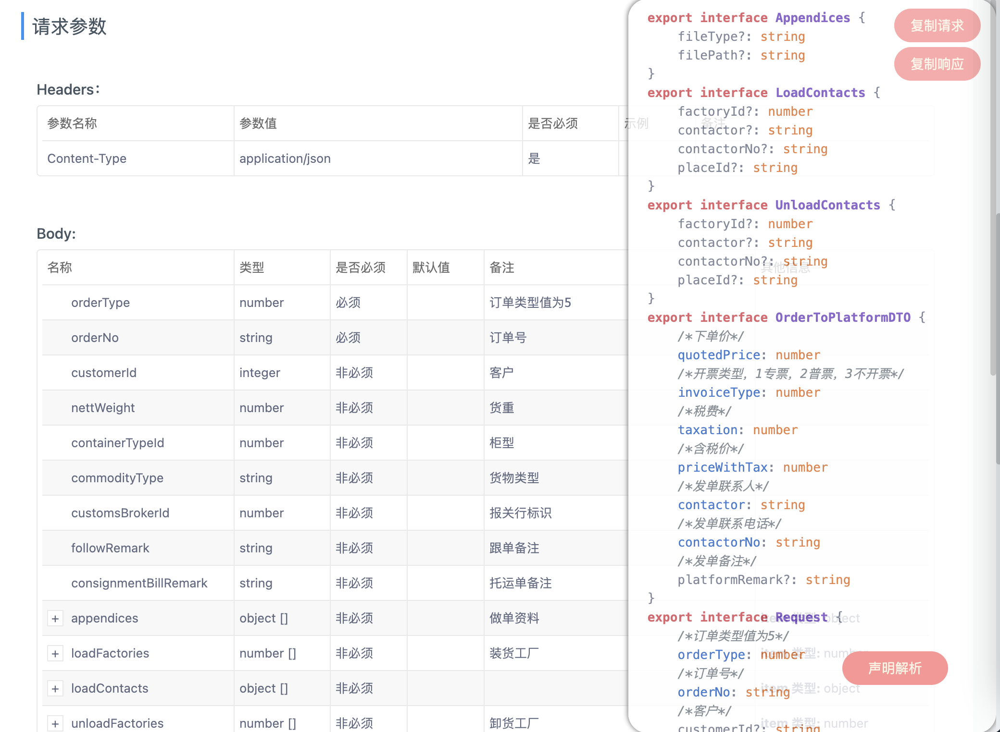

# yapi-plugin-typescript

该插件为 YApi 页面的 Chrome 插件，用于为数据自动生成 TS 的接口声明，效果如下图所示：


## 使用说明
先克隆本项目至本地，然后按照以下操作步骤进行使用：

### 安装依赖
克隆本项目至本地后，使用以下命令安装依赖：
```sh
pnpm install
```
### 作用域修改
Chrome 的插件需要指定可运行的目前网页，修改方式为：
1. 找到目录下 **manifest.json** 配置文件；
2. 修改 **matches** 配置字段中的页面链接匹配，以匹配需要作用的域名。

例如：需要把插件用于页面 https://www.test.com，需要做出如下修改：
```json
"matches": [
  "https://www.test.com/*"
]
```
使用通配符 **\*** 来匹配该页面下的所有路径。

### 构建插件
运行：
```sh
pnpm build
``` 
插件将完成构建，注意构建完成后目录将会出现一个 dist 目录。

### 加载插件
插件需要浏览器的扩展程序进入开发者模式，然后按照路径 **扩展管理 -> 已安装扩展 -> 加载已安装扩展** 来加载扩展，加载前需要自行构建目标插件，如果已经完成构建，选择 **dist** 文件夹即可加载。


